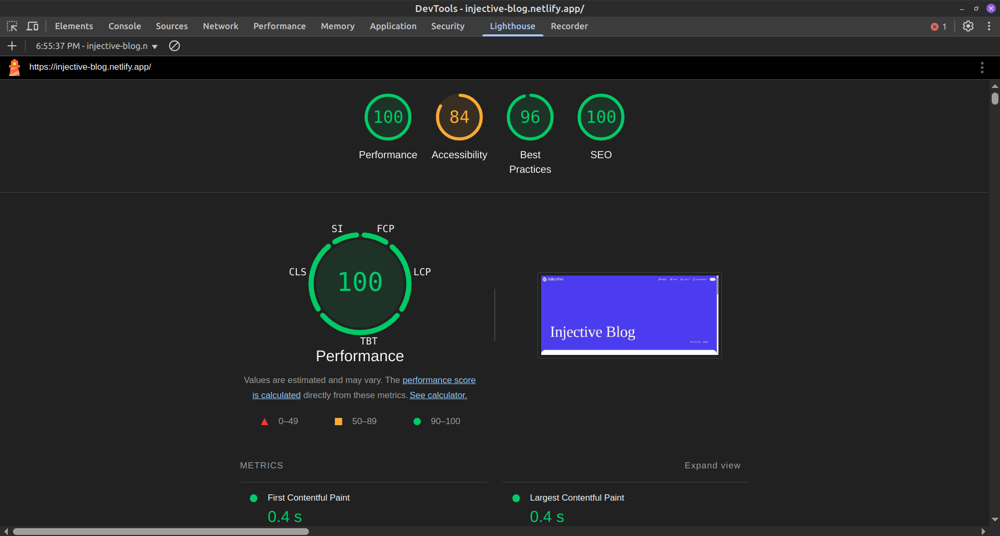
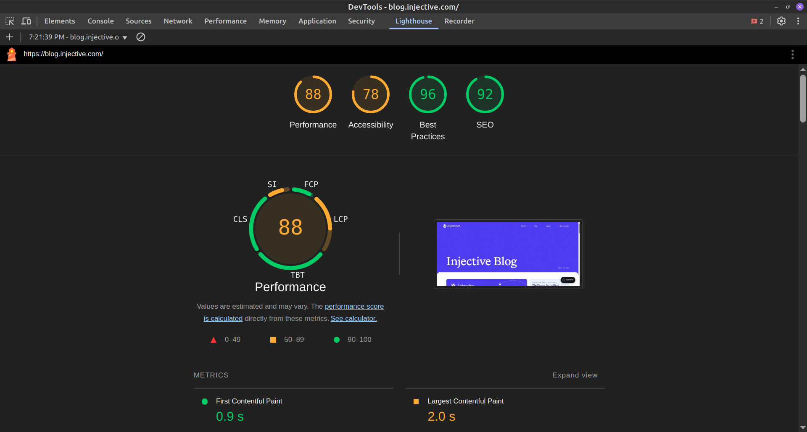

# Assignment from Injective Labs

## Table of Contents

-   [Description](#description)
-   [Tech Stack](#tech-stack)
-   [Performance Evaluation](#performance-evaluation)
-   [Choosing a Headless CMS](#choosing-a-headless-cms)
    1. [Defining Project Constraints](#defining-project-constraints)
    2. [Compiling Data](#compiling-data)
    3. [Conclusion](#conclusion)
- [Internationalization](#internationalization)
-   [Personal Opinions](#personal-opinions)
-   [Room for Improvement](#room-for-improvement)
-   [Local Set Up](#setting-up-the-project-locally)
-   [Troubleshooting](#troubleshooting)
-   [Final Thoughts](#final-thoughts)
    -   [What went well?](#what-went-well)
    -   [Challenges & Lessons](#challenges--lessons-learned)

## Description

Implement a mirror version of the [Injective Blog](https://blog.injective.com).

### Mandatory Features:

-   Home Page
-   A Single Blog Post Page

### Good-to-Have Features:

-   **Multi-Language Support:** The implementation should support blogs in more than one language.
-   **Social Sharing Meta Tags:** Blog post URLs should include social sharing meta tags, using the post’s featured image.

## Tech stack:

-   **Headless CMS:** [Sanity](#why-sanity)
-   Nuxt.js
-   Tailwind CSS
-   Nuxt UI
-   Composition API
-   TypeScript
-   **Deployment:** The application should be deployed to **Netlify with SSR enabled** (`ssr: true` for server-side rendering).

### Links

-   [Netlify Deploy - Injective Blog](https://injective-blog.netlify.app/)
-   [Sanity Studio](https://injective.sanity.studio/structure)

    **Note:** needs invitation from owner for auth.

## Performance Evaluation


### Lighthouse Report Overview

<div align="center">
  <table>
    <tr>
      <td align="center"><b>My Project</b></td>
      <td align="center"><b>Official Injective Blog</b></td>
    </tr>
    <tr>
      <td></td>
      <td></td>
    </tr>
    <tr>
      <td align="center">
        <a href="./docs/lighthouse/my-project-report/lighthouse-report.html" target="_blank">📄 View Full Report</a>
      </td>
      <td align="center">
        <a href="./docs/lighthouse/official-injective-blog-report/lighthouse-report.html" target="_blank">📄 View Full Report</a>
      </td>
    </tr>
  </table>
</div>

### Key Takeaways

-   **My project outperforms the official Injective Blog in all categories**, with higher scores in Performance, Accessibility, Best Practices and SEO.
-   However, **_performance scores should not be directly compared_** due to dataset size differences:
    -   The **official blog has significantly more posts**, leading to **larger API responses, more DOM elements, and increased rendering complexity**.
    -   My project only has **5 blog posts**, making API calls faster and improving **First Contentful Paint (FCP) and Largest Contentful Paint (LCP)** scores.
-   **Key optimizations contributing to my performance:**  
    ✅ **Server-side rendering (SSR) with Nuxt.js** significantly speeds up loading times.  
    ✅ **Sanity’s API response time** is highly efficient, minimizing delays when fetching content.
-   **Accessibility Considerations:**
    -   While my project has **higher accessibility score (84 vs. 78)**, there are **minor areas for improvement** that could be optimized further.
-   **Potential improvements:**
    Currently, images are served directly from Sanity’s CDN **without additional transformations**. By leveraging **Sanity’s Image API**, I can:

    -   **Enable automatic WebP/AVIF conversion** (`auto=format`)
    -   **Resize images dynamically** to match display size (`width=800`)
    -   **Improve lazy loading behavior**

    Example of an optimized image transformation:

    ```ts
    urlFor(post.mainImage).width(800).auto("format").url();
    ```

## Choosing A Headless CMS

When starting a new scalable project, selecting the right tools is crucial. In this case, choosing the best headless CMS is a key decision, but the market offers a vast array of options. For instance, [Jamstack site](https://jamstack.org) lists **126 different headless CMS solutions**.

### Defining Project Constraints

Considering the tech stack—**Nuxt.js and Netlify with SSR enabled**—I can define specific constraints to guide my decision:

1.  API Availability & Response Speed

    Since **Nuxt SSR** fetches data **at request time**, the CMS must:

    -   Provide the **fastest API response times** possible.
    -   Offer **rate limits or caching mechanisms** to prevent slow SSR performance.

2.  Serverless-Friendly (for Netlify)

    Since **Netlify runs Nuxt SSR on serverless functions**, the CMS should:

    -   **Handle multiple API requests efficiently**.
    -   Work well with **cold starts** (serverless functions can be slow).
    -   Provide **caching options** to mitigate slow dynamic fetches.

3.  Support for SSR Rendering

    The CMS should support SSR. To meet this criterion, the CMS should:

    -   Include **Nuxt.js modules or, at the very least, an integration guide**.
        -   A **Nuxt module** is preferred over just a guide, as it provides built-in optimizations, auto-imports, and SSR-friendly features.
    -   Support **webhooks** to trigger static rebuilds when necessary.

4.  SEO Metadata Support

    The CMS should:

    -   Allow storing **SEO metadata** (title, description, OG tags).
    -   Deliver **structured content** (e.g., blog posts, categories).
    -   Support **image optimization** via a built-in API.

### Compiling Data

I identified the **top 5 headless CMS platforms** based on [G2's ratings](https://www.g2.com/categories/headless-cms), sorted by **number of reviews (most to least)**.  
I also considered the **ease of use score** from [G2'S **Top 20 Easiest To Use Headless CMS Software**](https://www.g2.com/categories/headless-cms?rank=3&tab=easiest_to_use).

The table below presents these platforms, incorporating our defined constraints:

| CMS           | Rate Limits / Caching               | Netlify Integration | SSG & SSR Support | Nuxt module or guide | Webhooks | SEO Metadata Support | Image Optimization | **G2 Satisfaction Score (# of Reviews)** | **G2 Ease of Use Score (Rank)** |
| ------------- | ----------------------------------- | ------------------- | ----------------- | -------------------- | -------- | -------------------- | ------------------ | ---------------------------------------- | ------------------------------- |
| **Sanity**    | ✅ Real-time sync & global CDN      | ✅ Yes              | ✅ Yes            | Nuxt.js module       | ✅ Yes   | ✅ Yes               | ✅ Yes             | ⭐ **4.7 / 5** (**898 reviews**)         | **8.9 (#3 place)**              |
| **Umbraco**   | ✅ Caching available in cloud plans | ✅ Yes              | ✅ Yes            | ❌ None              | ✅ Yes   | ✅ Yes               | ✅ Yes             | ⭐ **4.5 / 5** (**779 reviews**)         | **8.9 (#2 place)**              |
| **Hygraph**   | ✅ Built-in caching and CDN         | ✅ Yes              | ✅ Yes            | Nuxt.js guide        | ✅ Yes   | ✅ Yes               | ✅ Yes             | ⭐ **4.5 / 5** (**566 reviews**)         | **8.8 (#4 place)**              |
| **Storyblok** | ✅ Built-in caching and CDN         | ✅ Yes              | ✅ Yes            | Nuxt.js module       | ✅ Yes   | ✅ Yes               | ✅ Yes             | ⭐ **4.5 / 5** (**458 reviews**)         | **8.9 (#1 place)**              |
| **Prismic**   | ✅ Built-in caching and CDN         | ✅ Yes              | ✅ Yes            | Nuxt.js module       | ✅ Yes   | ✅ Yes               | ✅ Yes             | ⭐ **4.3 / 5** (**303 reviews**)         | **8.6 (#5 place)**              |

### Conclusion

**After defining our project constraints and evaluating the top headless CMS options, [Sanity](https://www.sanity.io/) emerges as the best choice.**

#### **Why Sanity?**

✅ **Meets all technical criteria**:

-   **Real-time API with built-in caching & CDN**, ensuring fast response times.
-   **Fully compatible with Netlify & Nuxt.js SSR**, enabling seamless integration.
-   Provides a **Nuxt.js module**, which simplifies implementation and optimizes performance.

✅ **Best in terms of user feedback**:

-   **Highest satisfaction score** (⭐ 4.7 / 5) among the top CMS options.
-   **Most reviewed CMS** (898 reviews), indicating strong adoption and community trust.
-   **High score in ease of use** (8.9), making it accessible for developers.

✅ **Developer-friendly & scalable**:

-   Built-in support for **structured content, SEO metadata, and image optimization**.
-   **Webhooks available**, allowing seamless content updates.
-   A wealth of **official documentation** makes it easy to learn, integrate and upgrade.

## Internationalization

This project initially **did not prioritize internationalization**, and as a result, **its influence on the data structure was not considered from the beginning**. This was a *design flaw**, as localization affects how documents are structured, referenced, and queried.

To **properly integrate internationalization**, I should have structured the blog’s content following [Sanity’s best practices for Localization](https://www.sanity.io/docs/localization), ensuring a **clean, scalable, and easy-to-maintain approach**.

### Sanity Best Practices for Localization
Sanity provides **two main localization strategies**:
- Document-Level Localization (Separate documents per language)
    - Best for blog posts where each version needs independent publishing.
    - Ideal for Portable Text content (rich text blocks).
    - Allows different formatting, links, and images per language.

- Field-Level Localization (One document, multiple language fields)
    - Best for metadata, SEO fields, and reusable structured data (e.g., tags).
    - Ensures simpler queries and better maintainability.
    - Used when translations always exist together and should not be independently published.

For this project I would use a **mix both strategies** based on the content type.

### Choosing the Right Localization Method

#### Blog Posts → Document-Level Localization
- Each post is a **standalone entity** in a specific language.
- **Publishing schedules, formatting, and links may differ** per language.
- Allows **independent SEO optimizations**.
- A reference field links **translated versions together** for easier navigation.

**Why?** Since blog posts are **content-heavy and independently published**, a document-level approach is the best fit.

#### Tags → Field-Level Localization
- Tags are **simple structured data** that do not require **independent publishing**.
- Keeping translations **within a single document** simplifies maintenance.
- Queries remain **efficient**, dynamically selecting the correct language version.

**Why?** Since tags are **metadata** with the **same meaning across languages**, field-level localization is more appropriate.

#### Featured Posts → Field-Level Localization (Separate Arrays per Language)
- A **single document** manages featured posts for all languages.
- Editors can **view and update all language versions in one place**.
- Prevents **inconsistencies between featured content across languages**.

**Why?** Featured posts are **curated selections of existing content**, making **field-level localization with separate arrays per language** the best approach.

#### Site Settings (Metadata & SEO) → Field-Level Localization
- **Global metadata** like site title, meta descriptions, and SEO settings should be stored in **a single document**.
- Using **field-level localization** ensures metadata can be updated **without duplicating documents**.
- Queries remain **simple and efficient**, retrieving the correct language dynamically.

**Why?** Site metadata is **global** and does not require **independent publishing**, so a **single settings document with localized fields** is the best approach.

#### Footer → Field-Level Localization
- Contains **static, global content** (e.g., contact info, social links, copyright).
- Field-level localization allows **different text versions** for each language in **a single document**.
- Maintains **consistency in layout and design across languages**.

**Why?** Since the footer is **not content-heavy and does not require independent publishing**, **field-level localization** keeps it manageable and efficient.

### How to Implement These Changes
Since **internationalization was not originally considered**, and **backward compatibility would impact delivery time**, here’s the best approach to integration:

1. **Update schemas** while ensuring to maintain legacy schema types.
2. **Update frontend queries** to retrieve the correct language-specific content.
3. **Ensure proper translation links** between documents.
4. **Deploy the updated schema** and **test in Sanity Studio** before pushing to production.


## Personal Opinions

### Sanity

Learning Sanity was a smooth experience. There’s plenty of good documentation, and I never felt stuck.The most challenging part was embedding a YouTube video within the body of a post, but overall, it was an intuitive platform to work with.

### Nuxt.js

Straightforward and fast. It made development efficient without unnecessary complexity.

### Tailwind CSS

As easy as breathing. The utility-first approach makes styling quick and effortless.

### Nuxt UI

Nuxt UI was easy to pick up and performed well in terms of **performance, developer experience (DX), and accessibility**.

### Composition API

Very easy, especially since I’m already used to it. It feels natural to work with.

### TypeScript

No issues at all. I’m very familiar with it, so using it was seamless.

### Netlify

Working with Netlify was a bit tricky at first, but after overcoming some initial hurdles, I now feel confident using the platform.

One of the main challenges I faced was with the publish directory—I initially left it unset, assuming Netlify would automatically resolve it to .output, Nuxt's default build folder.

However, Netlify requires this to be explicitly set to dist for the deployment to work correctly. Once I made that adjustment, the JavaScript files loaded properly in production.

## Room for Improvement

### SEO Metadata Generation

Currently, the SEO metadata is dynamically generated using a composable (`useSeo`) that pulls data from each Nuxt page. While this approach works well, there's room for improvement to make it even more consistent, scalable, and editor-friendly.

#### Improvements

-   **Extract SEO content directly from the CMS** – Instead of manually defining metadata within each Nuxt page, the composable should automatically pull SEO-specific fields (meta title, description, and image) from the CMS.
-   **Ensure consistency across the entire application** – Centralizing SEO metadata ensures all pages follow the same structure, reducing redundancy and improving maintainability.
-   **Simplify the `useSeo` composable** – With metadata being sourced directly from the post, the composable will require less manual configuration, making it more lightweight and efficient.
-   **Give editors more control over social card generation** – Editors can customize SEO fields directly within the CMS, ensuring that Open Graph and Twitter card previews match their intended content without requiring developer intervention.

By implementing these improvements, SEO performance, **social media visibility**, and **developer experience** will be enhanced, creating a **more streamlined approach** to metadata management in the Nuxt application.

## Setting Up the Project Locally

To run the project locally, follow these steps:

### Prerequisites

Ensure you have the following installed on your system:

-   **Node.js** (Latest LTS recommended)
-   **npm** or **pnpm** (Preferred package manager for the project)
-   **Sanity CLI** (For managing the CMS studio)

```sh
npm install -g @sanity/cli
```

### Clone the Repository

```sh
git clone git@github.com:natalia-sampaio/injective-blog.git
cd injective-blog
```

### Install Dependencies

Navigate to both the Nuxt app and Sanity studio
directories to install dependencies.

#### Nuxt Layer (Frontend)

```sh
cd nuxt-layer
npm install  # or pnpm install
```

#### Studio Layer (Sanity CMS)

```sh
cd ../studio-layer
npm install  # or pnpm install
```

#### Run the Project Locally

##### Start the Sanity Studio

Sanity Studio is the CMS backend where content is managed. You need to run it before launching the Nuxt frontend.

```sh
cd studio-layer
npm run dev
```

        This will start Sanity Studio at http://localhost:3333/.

##### Start the Nuxt App

Once Sanity Studio is running, open a new terminal and start the Nuxt application.

```sh
cd nuxt-layer
npm run dev
```

        This will start the Nuxt app at http://localhost:3000/.

#### Build and Preview (Optional)

##### Run the Production Build

```sh
cd nuxt-layer
npm run build
npm run preview
```

        The preview will run the optimized production build locally.

#### Deploying (Optional)

##### Deploy Sanity Studio

To deploy your CMS to Sanity's hosting:

```sh
cd studio-layer
npm run deploy
```

## Troubleshooting

If the Nuxt app is not fetching data correctly:

-   Ensure **Sanity Studio is running** (`npm run dev` in `studio-layer`).

-   Check if the **Sanity dataset and project ID** are correctly configured in the Nuxt environment.

    ```sh
    // nuxt-layer/nuxt.config.ts

    export default defineNuxtConfig({
        compatibilityDate: "2024-11-01",
        modules: ["@nuxtjs/sanity"],
        sanity: {
            projectId: SANITY_PROJECT_ID,
            dataset: SANITY_DATASET,
        },
    });
    ```

-   **Schema or Query Updates Not Reflecting in the Nuxt App**

    If you modify **schemas (`studio-layer/schemaTypes`)** or **queries (`nuxt-layer/utils/queries.ts`)**, you need to **regenerate the types** before rebuilding and deploying:

    ```sh
    cd studio-layer
    npm run schema
    npm run typegen
    npm run build
    npm run deploy
    ```

    **Note:** If you create new schemas, make sure to add them to `schemaTypes/index.ts`

-   If dependencies are missing, try running `npm install` again inside each directory.

## Final Thoughts

This project provided a great opportunity to explore **Sanity, Nuxt.js, and server-side rendering (SSR) with Netlify**. Through testing and evaluation, **Sanity emerged as the best CMS choice**, offering **scalability, strong developer support, and real-time API performance.**

### What Went Well?

-   **Sanity** – Easy learning curve with solid documentation.
-   **Nuxt.js** – Fast and efficient development experience.
-   **Tailwind CSS** – Simple, clean styling with a utility-first approach.

### Challenges & Lessons Learned

-   **Netlify deployment required tweaking** – Setting the publish directory to `dist` was necessary for a successful build.
-   **Not considering internationalization from the start was a design flaw** – The original data structure did not account for multilingual content, requiring significant refactoring to support localization properly. Future projects should plan for internationalization early to avoid breaking changes and backward compatibility issues.
